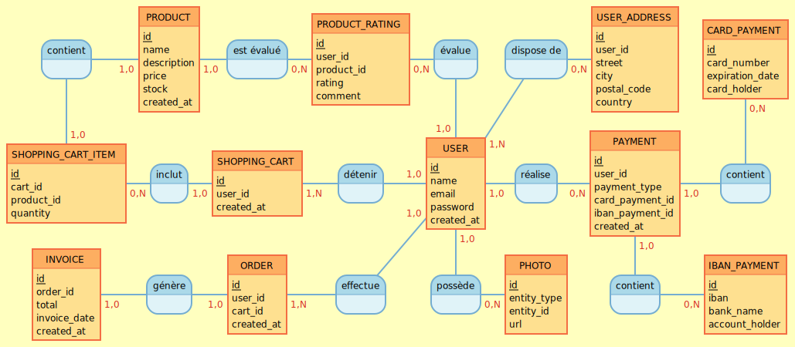

## Partie 1 – MCD (Modèle Conceptuel de Données)

Le modèle conceptuel de données a été conçu pour représenter les entités et leurs relations dans le système de gestion de la base de données pour le site e-commerce. Ce modèle permet de gérer les utilisateurs, leurs commandes, ainsi que les produits et les paiements associés.

##### **Table : `user`**
- **Rôle** : Stocker les informations des utilisateurs.
- **Attributs** :
    - `id` : Identifiant unique de l'utilisateur.
    - `name` : Nom de l'utilisateur.
    - `email` : Email de l'utilisateur (doit être unique).
    - `password` : Mot de passe de l'utilisateur, stocké sous forme hachée.
    - `created_at` : Date de création de l'utilisateur (par défaut, l’heure actuelle).

##### **Table : `user_address`**
- **Rôle** : Stocker les adresses associées aux utilisateurs.
- **Attributs** :
    - `id` : Identifiant unique de l'adresse.
    - `user_id` : Identifiant de l'utilisateur (clé étrangère vers `user`).
    - `street` : Rue.
    - `city` : Ville.
    - `postal_code` : Code postal.
    - `country` : Pays.

##### **Table : `product`**
- **Rôle** : Stocker les informations des produits disponibles à la vente.
- **Attributs** :
    - `id` : Identifiant unique du produit.
    - `name` : Nom du produit.
    - `description` : Description détaillée du produit.
    - `price` : Prix du produit.
    - `stock` : Quantité en stock.
    - `created_at` : Date de création du produit.

##### **Table : `shopping_cart`**
- **Rôle** : Représenter les paniers d'achat des utilisateurs.
- **Attributs** :
    - `id` : Identifiant unique du panier.
    - `user_id` : Identifiant de l'utilisateur (clé étrangère vers `user`).
    - `created_at` : Date de création du panier.

##### **Table : `shopping_cart_item`**
- **Rôle** : Stocker les articles ajoutés dans un panier.
- **Attributs** :
    - `id` : Identifiant unique de l'article.
    - `cart_id` : Identifiant du panier (clé étrangère vers `shopping_cart`).
    - `product_id` : Identifiant du produit (clé étrangère vers `product`).
    - `quantity` : Quantité de ce produit dans le panier.

##### **Table : `order`**
- **Rôle** : Représenter les commandes passées par les utilisateurs.
- **Attributs** :
    - `id` : Identifiant unique de la commande.
    - `user_id` : Identifiant de l'utilisateur (clé étrangère vers `user`).
    - `cart_id` : Identifiant du panier lié à la commande (clé étrangère vers `shopping_cart`).
    - `created_at` : Date de création de la commande.

##### **Table : `invoice`**
- **Rôle** : Générer les factures pour chaque commande.
- **Attributs** :
    - `id` : Identifiant unique de la facture.
    - `order_id` : Identifiant de la commande (clé étrangère vers `order`).
    - `total` : Montant total de la facture.
    - `invoice_date` : Date de facturation.
    - `created_at` : Date de création de l'enregistrement.

##### **Table : `product_rating`**
- **Rôle** : Stocker les évaluations des produits par les utilisateurs.
- **Attributs** :
    - `id` : Identifiant unique de l'évaluation.
    - `user_id` : Identifiant de l'utilisateur (clé étrangère vers `user`).
    - `product_id` : Identifiant du produit (clé étrangère vers `product`).
    - `rating` : Note donnée au produit (entre 1 et 5).
    - `comment` : Commentaire de l'utilisateur.

##### **Table : `photo`**
- **Rôle** : Stocker les photos associées aux entités `user` ou `product`.
- **Attributs** :
    - `id` : Identifiant unique de la photo.
    - `entity_type` : Type d'entité (`user` ou `product`).
    - `entity_id` : Identifiant de l'entité associée.
    - `url` : URL de l'image.

##### **Table : `card_payment`**
- **Rôle** : Stocker les informations des paiements par carte bancaire.
- **Attributs** :
    - `id` : Identifiant unique du paiement.
    - `card_number` : Numéro de la carte.
    - `expiration_date` : Date d’expiration.
    - `card_holder` : Titulaire de la carte.

##### **Table : `iban_payment`**
- **Rôle** : Stocker les informations des paiements par IBAN.
- **Attributs** :
    - `id` : Identifiant unique du paiement.
    - `iban` : Numéro IBAN.
    - `bank_name` : Nom de la banque.
    - `account_holder` : Titulaire du compte.

##### **Table : `payment`**
- **Rôle** : Centraliser les paiements effectués par les utilisateurs.
- **Attributs** :
    - `id` : Identifiant unique du paiement.
    - `user_id` : Identifiant de l'utilisateur (clé étrangère vers `user`).
    - `payment_type` : Type de paiement (`card` ou `iban`).
    - `card_payment_id` : Identifiant du paiement par carte (clé étrangère vers `card_payment`).
    - `iban_payment_id` : Identifiant du paiement par IBAN (clé étrangère vers `iban_payment`).
    - `created_at` : Date de création du paiement.

## Structure des Tables et Attributs
Pour concevoir le modèle conceptuel de données, j'ai utilisé **[Mocodo](https://www.mocodo.net)**, un outil permettant de générer des diagrammes MCD à partir d'une description textuelle simple. Cela m'a permis de rapidement structurer les entités et leurs relations tout en facilitant la génération automatique de schémas visuels.

Description textuelle des entités et relations:
```mocodo
contient1, 10 SHOPPING_CART_ITEM, 10 PRODUCT
PRODUCT: id, name, description, price, stock, created_at
est évalué, 10 PRODUCT, 0N PRODUCT_RATING
PRODUCT_RATING: id, user_id, product_id, rating, comment
évalue, 10 USER, 0N PRODUCT_RATING
dispose de, 1N USER, 0N USER_ADDRESS
USER_ADDRESS: id, user_id, street, city, postal_code, country
CARD_PAYMENT: id, card_number, expiration_date, card_holder

SHOPPING_CART_ITEM: id, cart_id, product_id, quantity
inclut, 10 SHOPPING_CART, 0N SHOPPING_CART_ITEM
SHOPPING_CART: id, user_id, created_at
détenir, 10 USER, 1N SHOPPING_CART
USER: id, name, email, password, created_at
réalise, 10 USER, 0N PAYMENT
PAYMENT: id, user_id, payment_type, card_payment_id, iban_payment_id, created_at
contient2, 10 PAYMENT, 0N CARD_PAYMENT
INVOICE: id, order_id, total, invoice_date, created_at
génère, 10 ORDER, 10 INVOICE
ORDER: id, user_id, cart_id, created_at
effectue, 10 USER, 1N ORDER
possède, 10 USER, 0N PHOTO
PHOTO: id, entity_type, entity_id, url
contient3, 10 PAYMENT, 0N IBAN_PAYMENT
IBAN_PAYMENT: id, iban, bank_name, account_holder
```


[lien de partage MOCODO](https://www.mocodo.net/?mcd=eNptk01ynDAQhfc6hQ7AYibZZUdmqJiFYYrBqcpKJUuyozJIRGqccCNzDi4WIcEMP96A1MB7re81TCuQQsExwscDvj7kl0ua_SCnuChJWiaPvnwp8vPTqUTT_RuWPMKK1iLCXFhmZANSqwg3RjJXs6DZW4SZERQEJxSQsICH_p1W7dAvFSN8yOY1KeLSWaP1Nni1VhgyLhqjecvArw0FqV6dj65rdwIUDITXf7omxWfiXNpGW-Hadq9l99fGBYnP5yK5XtFys_G3YIQA5ymhc91oC7QiTI9yTLcKTIccujO5xL8ek2wixajhRLX1szARFv8aOXauFeEOz_T0t664MAjtA7hJwA7An5a68KBDUrGqhX2C_mh7ybXL5oSL1PjQg1DSLIgeN3qe1XIeRE1l5dqk1v7VZq1nhp5W0m4TCqjQCtk9cNqN4RLompnVXBofy2eqVoWFHZtG-0uYuCDvLZcRIZRmP_P0lARj1_PkDNpl6xzUu3ZTPYd1l38dejV8mHCavDh7PAc8qSFf2bKdU1z-Gi8vgsFqbB1k_zVy82WHD74F9pCXOfLXoC_8FEyIpo33NdUNwtcdhPR7nN0gLDdBdCQbYXd5IyFZyvyEz6P6H7e4W_U=).

---
## Partie 2 – Création de la base de données et des tables SQL
### Première étape :
- **Installation de XAMPP** : Installation de XAMPP pour faciliter l’utilisation de PhpMyAdmin avec la base de données SQL.
- **Configuration rapide de XAMPP** : Configuration de XAMPP pour démarrer les services Apache et MySQL.
- **Accès à PhpMyAdmin** : Accès à PhpMyAdmin en se rendant à la page [phpmyadmin](http://localhost/phpmyadmin/index.php).

### Seconde étape :
##### Création de la base de données
```SQL
CREATE DATABASE e_commerce;

-- Sélection de la base de données
USE e_commerce;
```


- **Création des tables** : Les tables suivantes ont été créées dans la base de données `e_commerce`
##### Création de la table `user`
```SQL
CREATE TABLE user (
    id INT AUTO_INCREMENT PRIMARY KEY,
    name VARCHAR(100),
    email VARCHAR(100) UNIQUE,
    password VARCHAR(255),
    created_at TIMESTAMP DEFAULT CURRENT_TIMESTAMP
);
```

##### Création de la table `user_address`
```SQL
CREATE TABLE user_address (
    id INT AUTO_INCREMENT PRIMARY KEY,
    user_id INT,
    street VARCHAR(255),
    city VARCHAR(100),
    postal_code VARCHAR(20),
    country VARCHAR(100),
    FOREIGN KEY (user_id) REFERENCES user(id)
);
```

##### Création de la table `product`
```SQL
CREATE TABLE product (
    id INT AUTO_INCREMENT PRIMARY KEY,
    name VARCHAR(100),
    description TEXT,
    price DECIMAL(10, 2),
    stock INT,
    created_at TIMESTAMP DEFAULT CURRENT_TIMESTAMP
);
```

##### Création de la table `shopping_cart`
```SQL
CREATE TABLE shopping_cart (
    id INT AUTO_INCREMENT PRIMARY KEY,
    user_id INT,
    created_at TIMESTAMP DEFAULT CURRENT_TIMESTAMP,
    FOREIGN KEY (user_id) REFERENCES user(id)
);
```

##### Création de la table `shopping_cart_item`
```SQL
CREATE TABLE shopping_cart_item (
    id INT AUTO_INCREMENT PRIMARY KEY,
    cart_id INT,
    product_id INT,
    quantity INT,
    FOREIGN KEY (cart_id) REFERENCES shopping_cart(id),
    FOREIGN KEY (product_id) REFERENCES product(id)
);
```

##### Création de la table `order`
```SQL
CREATE TABLE `order` (
    id INT AUTO_INCREMENT PRIMARY KEY,
    user_id INT,
    cart_id INT,
    created_at TIMESTAMP DEFAULT CURRENT_TIMESTAMP,
    FOREIGN KEY (user_id) REFERENCES user(id),
    FOREIGN KEY (cart_id) REFERENCES shopping_cart(id)
);
```

##### Création de la table `invoice`
```SQL
CREATE TABLE invoice (
    id INT AUTO_INCREMENT PRIMARY KEY,
    order_id INT,
    total DECIMAL(10, 2),
    invoice_date DATE,
    created_at TIMESTAMP DEFAULT CURRENT_TIMESTAMP,
    FOREIGN KEY (order_id) REFERENCES `order`(id)
);
```

##### Création de la table `product_rating`
```SQL
CREATE TABLE product_rating (
    id INT AUTO_INCREMENT PRIMARY KEY,
    user_id INT,
    product_id INT,
    rating INT CHECK (rating >= 1 AND rating <= 5),
    comment TEXT,
    FOREIGN KEY (user_id) REFERENCES user(id),
    FOREIGN KEY (product_id) REFERENCES product(id)
);
```

##### Création de la table `photo`
```SQL
CREATE TABLE photo (
    id INT AUTO_INCREMENT PRIMARY KEY,
    entity_type ENUM('user', 'product') NOT NULL,
    entity_id INT NOT NULL,
    url VARCHAR(255),
    FOREIGN KEY (entity_id) REFERENCES user(id) ON DELETE CASCADE,
    FOREIGN KEY (entity_id) REFERENCES product(id) ON DELETE CASCADE
);
```

##### Création de la table `card_payment`
```SQL
CREATE TABLE card_payment (
    id INT AUTO_INCREMENT PRIMARY KEY,
    card_number VARCHAR(16) NOT NULL,
    expiration_date DATE NOT NULL,
    card_holder VARCHAR(100)
);
```

##### Création de la table `iban_payment`
```SQL
CREATE TABLE iban_payment (
    id INT AUTO_INCREMENT PRIMARY KEY,
    iban VARCHAR(34) NOT NULL,
    bank_name VARCHAR(100),
    account_holder VARCHAR(100)
);
```

##### Création de la table `payment`
```SQL
CREATE TABLE payment (
    id INT AUTO_INCREMENT PRIMARY KEY,
    user_id INT,
    payment_type ENUM('card', 'iban') NOT NULL,
    card_payment_id INT NULL,
    iban_payment_id INT NULL,
    created_at TIMESTAMP DEFAULT CURRENT_TIMESTAMP,
    FOREIGN KEY (user_id) REFERENCES user(id),
    FOREIGN KEY (card_payment_id) REFERENCES card_payment(id),
    FOREIGN KEY (iban_payment_id) REFERENCES iban_payment(id)
);
```

---
### Troisième étape : Remplissage de la base de données avec des données factices
Pour remplir notre base de données avec des données aléatoires, nous allons utiliser la bibliothèque Faker en PHP. Cette bibliothèque nous permet de générer facilement des données fictives pour nos tables.

#### Installation de Composer
Pour utiliser Faker, il est nécessaire d'installer Composer, un outil qui facilite la gestion des dépendances en PHP.

1. **Installation de Composer** : Téléchargez et installez Composer depuis [getcomposer.org](https://getcomposer.org).
2. **Installation de Faker** : Une fois Composer installé, ouvrez votre terminal et exécutez la commande suivante pour installer Faker :
    ```bash
    composer require fakerphp/faker
    ```

#### Création d'un fichier `generate_faker.php`
Ce fichier est responsable du remplissage de la base de données avec des données aléatoires. Il utilise Faker pour générer des données pour chaque table, comme les utilisateurs, les produits, les commandes, et les factures.
```php
<?php

require_once 'vendor/autoload.php'; // Charge les dépendances installées, notamment Faker

$faker = Faker\Factory::create(); // Initialise Faker pour générer des données fictives

// Configuration de la connexion à la base de données
$host = "localhost"; 
$username = "root"; 
$password = ""; 
$dbname = "e_commerce";

// Connexion à la base de données
$conn = new mysqli($host, $username, $password, $dbname);

// Vérification de la connexion
if ($conn->connect_error) {
    die("Connection failed: " . $conn->connect_error); // Stoppe le script si la connexion échoue
}

// Déclaration des variables pour le nombre d'entrées à générer
$numUsers = 10;
$numProducts = 20;
$numAddresses = $numUsers;
$numCarts = $numUsers;
$numCartItems = 30;
$numOrders = $numUsers;
$numInvoices = $numOrders;
$numRatings = 20;
$numPhotos = 15;
$numPayments = $numUsers;

// Fonction pour remplir la table `user`
function generateUsers($conn, $faker, $numUsers) {
    for ($i = 0; $i < $numUsers; $i++) {
        $name = $faker->name;
        $email = $faker->unique()->safeEmail; // Adresse email unique
        $password = password_hash($faker->password, PASSWORD_BCRYPT); // Mot de passe haché

        $sql = "INSERT INTO user (name, email, password) VALUES ('$name', '$email', '$password')";
        $conn->query($sql); // Exécute l'insertion
    }
    echo "$numUsers users added.\n"; // Confirme l'ajout
}

// Fonction pour remplir la table `user_address`
function generateUserAddresses($conn, $faker, $numAddresses) {
    for ($i = 0; $i < $numAddresses; $i++) {
        $userId = $i + 1; // L'ID de l'utilisateur est basé sur l'index
        $street = $faker->streetAddress;
        $city = $faker->city;
        $postalCode = $faker->postcode;
        $country = $faker->country;

        $sql = "INSERT INTO user_address (user_id, street, city, postal_code, country) VALUES ($userId, '$street', '$city', '$postalCode', '$country')";
        $conn->query($sql);
    }
    echo "$numAddresses addresses added for each user.\n";
}

// Fonction pour remplir la table `product`
function generateProducts($conn, $faker, $numProducts) {
    for ($i = 0; $i < $numProducts; $i++) {
        $name = $faker->word;
        $description = $faker->text(200);
        $price = $faker->randomFloat(2, 1, 100); // Prix aléatoire entre 1 et 100
        $stock = $faker->numberBetween(1, 100); // Stock aléatoire

        $sql = "INSERT INTO product (name, description, price, stock) VALUES ('$name', '$description', $price, $stock)";
        $conn->query($sql);
    }
    echo "$numProducts products added.\n";
}

// Fonction pour remplir la table `shopping_cart`
function generateShoppingCarts($conn, $numCarts) {
    for ($i = 0; $i < $numCarts; $i++) {
        $userId = $i + 1; // Associe un panier à chaque utilisateur

        $sql = "INSERT INTO shopping_cart (user_id) VALUES ($userId)";
        $conn->query($sql);
    }
    echo "$numCarts shopping carts added for each user.\n";
}

// Fonction pour remplir la table `shopping_cart_item`
function generateShoppingCartItems($conn, $numCartItems, $numProducts) {
    for ($i = 0; $i < $numCartItems; $i++) {
        $cartId = rand(1, 10); // Panier aléatoire
        $productId = rand(1, $numProducts); // Produit aléatoire
        $quantity = rand(1, 5); // Quantité aléatoire

        $sql = "INSERT INTO shopping_cart_item (cart_id, product_id, quantity) VALUES ($cartId, $productId, $quantity)";
        $conn->query($sql);
    }
    echo "$numCartItems shopping cart items added.\n";
}

// Fonction pour remplir la table `order`
function generateOrders($conn, $numOrders) {
    for ($i = 0; $i < $numOrders; $i++) {
        $userId = $i + 1;
        $cartId = $i + 1; // Chaque commande correspond à un panier

        $sql = "INSERT INTO `order` (user_id, cart_id) VALUES ($userId, $cartId)";
        $conn->query($sql);
    }
    echo "$numOrders orders created for each shopping cart.\n";
}

// Fonction pour remplir la table `invoice`
function generateInvoices($conn, $numInvoices) {
    for ($i = 0; $i < $numInvoices; $i++) {
        $orderId = $i + 1; // Facture pour chaque commande
        $total = rand(20, 200); // Montant total aléatoire
        $invoiceDate = date('Y-m-d', strtotime('-' . rand(0, 30) . ' days')); // Date aléatoire récente

        $sql = "INSERT INTO invoice (order_id, total, invoice_date) VALUES ($orderId, $total, '$invoiceDate')";
        $conn->query($sql);
    }
    echo "$numInvoices invoices added for each order.\n";
}

// Fonction pour remplir la table `product_rating`
function generateProductRatings($conn, $faker, $numRatings, $numProducts, $numUsers) {
    for ($i = 0; $i < $numRatings; $i++) {
        $userId = rand(1, $numUsers); // Utilisateur aléatoire
        $productId = rand(1, $numProducts); // Produit aléatoire
        $rating = rand(1, 5); // Note entre 1 et 5
        $comment = $faker->text(100);

        $sql = "INSERT INTO product_rating (user_id, product_id, rating, comment) VALUES ($userId, $productId, $rating, '$comment')";
        $conn->query($sql);
    }
    echo "$numRatings product ratings added.\n";
}

// Fonction pour remplir la table `photo`
function generatePhotos($conn, $faker, $numPhotos, $numUsers, $numProducts) {
    for ($i = 0; $i < $numPhotos; $i++) {
        $entityType = rand(0, 1) === 0 ? 'user' : 'product'; // Détermine si la photo est pour un utilisateur ou un produit
        $entityId = $entityType === 'user' ? rand(1, $numUsers) : rand(1, $numProducts);
        $photoUrl = $faker->imageUrl(); // URL de la photo

        $sql = "INSERT INTO photo (entity_type, entity_id, url) VALUES ('$entityType', $entityId, '$photoUrl')";
        if (!$conn->query($sql)) {
            echo "Error inserting photo: " . $conn->error . "\n";
        }
    }
    echo "$numPhotos photos added.\n";
}

// Fonction pour remplir les tables de paiement
function generateCardPayments($conn, $numPayments) {
    global $faker; 
    for ($i = 0; $i < $numPayments; $i++) {
        $cardNumber = $faker->creditCardNumber;
        $expirationDate = date('Y-m-d', strtotime('+1 year'));
        $cardHolder = $faker->name;

        $sql = "INSERT INTO card_payment (card_number, expiration_date, card_holder) VALUES ('$cardNumber', '$expirationDate', '$cardHolder')";
        $conn->query($sql);
    }
    echo "$numPayments card payments added.\n";
}

function generateIbanPayments($conn, $numPayments) {
    global $faker; 
    for ($i = 0; $i < $numPayments; $i++) {
        $iban = $faker->iban;
        $bankName = $faker->company;
        $accountHolder = $faker->name;

        $sql = "INSERT INTO iban_payment (iban, bank_name, account_holder) VALUES ('$iban', '$bankName', '$accountHolder')";
        $conn->query($sql);
    }
    echo "$numPayments IBAN payments added.\n";
}

function generatePayments($conn, $numPayments, $numOrders) {
    for ($i = 0; $i < $numPayments; $i++) {
        $orderId = rand(1, $numOrders);
        $paymentMethod = rand(0, 1) === 0 ? 'card' : 'iban';

        $cardPaymentId = $paymentMethod === 'card' ? rand(1, $numPayments) : "NULL";
        $ibanPaymentId = $paymentMethod === 'iban' ? rand(1, $numPayments) : "NULL";

        $sql = "INSERT INTO payment (user_id, payment_type, card_payment_id, iban_payment_id) VALUES (
            (SELECT user_id FROM `order` WHERE id = $orderId), 
            '$paymentMethod', 
            $cardPaymentId, 
            $ibanPaymentId
        )";

        if (!$conn->query($sql)) {
            echo "Error inserting payment: " . $conn->error . "\n";
        }
    }
    echo "$numPayments payments added for each order.\n";
}

// Exécution des fonctions de peuplement
generateUsers($conn, $faker, $numUsers);
generateUserAddresses($conn, $faker, $numAddresses);
generateProducts($conn, $faker, $numProducts);
generateShoppingCarts($conn, $numCarts);
generateShoppingCartItems($conn, $numCartItems, $numProducts);
generateOrders($conn, $numOrders);
generateInvoices($conn, $numInvoices);
generateProductRatings($conn, $faker, $numRatings, $numProducts, $numUsers);
generatePhotos($conn, $faker, $numPhotos, $numUsers, $numProducts);
generateCardPayments($conn, $numPayments);
generateIbanPayments($conn, $numPayments);
generatePayments($conn, $numPayments, $numOrders);

// Fermeture de la connexion
$conn->close();
?>
```

#### Vérification des données
Une fois que le script `generate_faker.php` a été exécuté, on peut vérifier que toutes les données ont été insérées correctement dans votre base de données en vous rendant sur la page [phpMyAdmin](http://localhost/phpmyadmin/index.php).
